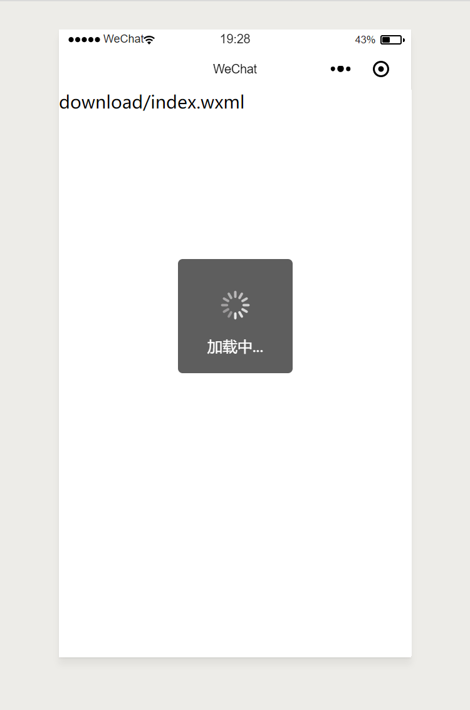

# WeFun

实现微信小程序的一些功能，可供参考，不是完整项目

## 目录

[文件下载](#1)


<h2 id='1'>文件下载</h2>

在 .js 中加入 load 事件
```js
dowmload: function() {
    this.setData({
      loadingHidden: false
    })  
    let _that = this;
    wx.downloadFile({
      url: 'https://lg-332ncmjq-1256907309.cos.ap-shanghai.myqcloud.com/stepking/a.xlsx',
      success: function(res) {
        var filePath = res.tempFilePath;
        console.log(res)     //页面显示加载动画        
        wx.openDocument({     
          filePath: filePath,
               success: function(res) {      
            _that.setData({       
              loadingHidden: true      
            })      
            console.log('打开文档成功')     
          }    
        })   
      }  
    }) 
  },
```

在 .wxml 中的下载按钮中加入
```html
bindtap="download"
```

弹出提示
在组件外加入即可
```html
<loading hidden="{{  loadingHidden }}">
加载中...
</loading>
```


<div align="center">

<!-- 


 -->

 </div>